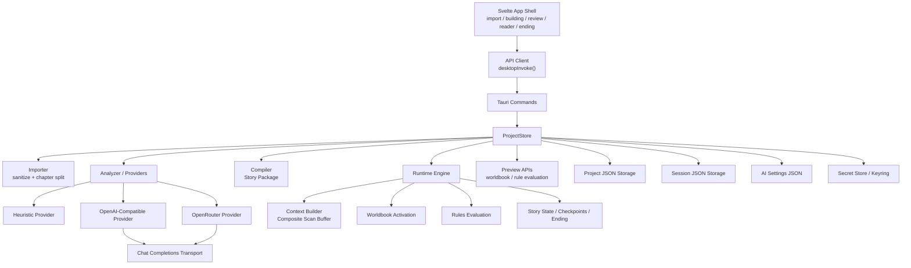
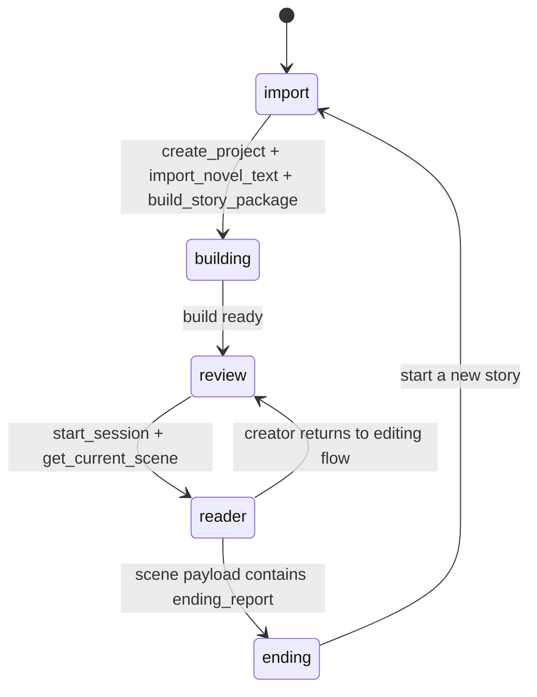
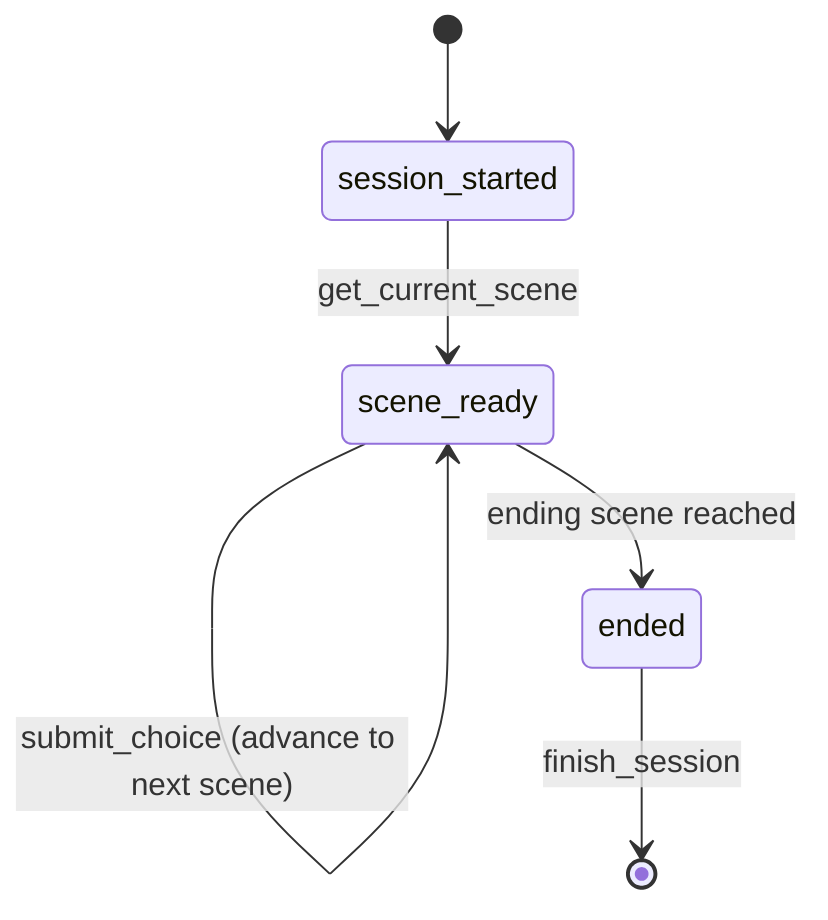

# 叙世者系统 Specification

> 当前仓库的架构主入口已切换到 [docs/architecture-guide.md](./architecture-guide.md)，实施顺序主入口已切换到 [docs/implementation-roadmap-v1.md](./implementation-roadmap-v1.md)，界面与视觉系统主入口已切换到 [docs/superpowers/specs/2026-04-22-global-visual-system-design.md](./superpowers/specs/2026-04-22-global-visual-system-design.md)。
>
> 本文档仍然是系统语义、术语和目标行为的重要参考，但不再单独承担“架构总蓝图 + 实施路线图”两种职责。当前仓库已经具备本地 `v1` 闭环基线，若与运行中代码冲突，请以代码行为为准。

## 文档定位与使用方式

本文档是 `叙世者` 的系统级 specification，面向产品、设计与研发混合读者，用于统一回答三个问题：

- 这个系统最终要成为什么
- 当前仓库里的原型已经验证了什么
- 从原型走向目标系统还缺哪些关键能力

本文档不是 README 的重复，也不是一次性的想法记录。它是仓库内最高层级的系统说明，覆盖产品目标、逻辑架构、核心模块、数据对象、命令接口、运行时状态机与术语。

涉及 `UI / UX / 视觉 / 布局 / 组件样式` 的问题时，应与 `README.md` 中的文档入口一起阅读全局视觉系统规范，而不是仅凭本文档推导界面实现。

使用约定如下：

- `目标规格` 表示系统希望长期满足的行为与边界
- `当前原型` 表示截至当前仓库实现已经存在的事实能力
- `差距与演进方向` 表示目标系统相对当前原型的缺口，不等同于已实现功能

当本文档与当前代码行为冲突时：

- 讨论当前可运行原型时，以代码为准
- 讨论未来演进、模块边界和验收目标时，以本文档为准

## 产品定义

`叙世者` 是一个将中文小说解析、结构化建模、审阅修正并转化为可游玩互动叙事体验的桌面应用。

它不是以下任一种产品的简单变体：

- 不是普通的电子书阅读器，因为系统并不止于展示原文
- 不是纯聊天式角色扮演工具，因为核心体验不是临场自由扮演，而是基于结构化世界模型运行故事
- 不是传统手工编写的视觉小说引擎，因为上游输入首先是一部原著文本，而不是已经人工拆好的场景图

系统的核心使命是打通以下链路：

1. 导入一部小说原文
2. 提炼出角色、地点、时间线、关系、世界规则与关键冲突
3. 将提炼结果组织为可编辑、可计算的世界模型
4. 在世界模型上编译互动场景与运行时约束
5. 让创作者审阅和修正结果
6. 让读者进入故事、做出选择、触发后果并到达结局

## 目标与非目标

### 目标

- 支持以中文纯文本小说为输入，构建结构化故事中间层
- 支持把结构化结果转为可审阅、可修正、可游玩的互动 Story Package
- 支持显式 worldbook、显式 rules、显式 story state，而不是只依赖模型临场推断
- 支持创作者工作流和读者工作流共存于同一桌面应用
- 支持多 AI provider 接入，并将模型输出收敛到统一的内部数据结构
- 支持回溯、结局总结、活跃 lore 展示、规则命中解释等运行时能力

### 非目标

- 当前阶段不覆盖账号、协作、社区、云同步与在线发布平台
- 当前阶段不承诺 epub、docx、pdf 等多格式导入
- 当前阶段不构建通用沙盒文字冒险平台
- 当前阶段不包含完整的素材资产生产管线，如 AI 立绘、配音、镜头资源管理
- 当前阶段不承诺长期稳定的数据兼容性或插件生态

## 核心用户与核心场景

### 核心用户

- 创作者
  - 导入原著文本
  - 检查 AI 提炼结果
  - 修正角色卡、世界书与规则
  - 预览 lore 激活与规则判断
  - 产出可游玩的故事包
- 读者
  - 启动一个已编译的故事
  - 在阅读器中浏览叙事、台词和世界侧栏
  - 做出选项或自由输入
  - 查看当前激活 lore、已命中规则、人物与时间线信息
  - 回溯 checkpoint 并查看结局总结

### 核心场景

1. 创作者导入小说后等待系统分析并生成初版 story package
2. 创作者在审阅工作台中修正角色、worldbook 与规则定义
3. 创作者预览某个 scene 的活跃 lore 与 rule evaluation，确认编排是否符合预期
4. 读者进入故事运行时，基于当前 scene 做选择或自由输入
5. 系统根据 state、worldbook、rules 和 scene graph 计算下一步内容
6. 读者在故事推进中查看 codex、回溯 checkpoint，最终到达 ending

## 端到端系统流程

系统的端到端流程可以抽象为八个阶段：

1. `导入`
   - 创建项目
   - 接收原文
   - 清洗文本并切分章节
2. `提炼`
   - 选择 AI provider
   - 提交原文到启发式或外部模型分析器
   - 产出结构化提炼结果
3. `世界模型构建`
   - 生成角色卡、worldbook、rules 与 story bible
   - 写入项目级存储
4. `互动编译`
   - 将提炼结果编译为 story package
   - 生成 scene graph、起始 scene 和 ending skeleton
5. `审阅`
   - 编辑角色卡、worldbook、rules
   - 对预览 scene 做 lore 激活和 rule evaluation 检查
6. `运行时启动`
   - 基于 story package 创建 session
   - 初始化 story state、lore lifecycle 和 checkpoints
7. `互动游玩`
   - 读取当前 scene
   - 提交 choice 或 free input
   - 计算状态变化、规则命中、激活 lore 与下一 scene
8. `结束与持久化`
   - 展示结局总结
   - 保存 session、项目与 AI 设置

## 系统架构

### 架构说明

- 前端采用 Svelte 单页应用形态，通过统一 API client 调用桌面命令面
- 桌面能力由 Tauri command 层暴露，Rust `ProjectStore` 作为应用状态与持久化中心
- 导入、提炼、编译、运行时、预览和存储由独立模块承担职责
- 外部模型 provider 与本地启发式 provider 共享统一的提炼输出结构
- Story Package 是创作者工作流与读者工作流之间的关键交接物

## 模块规格

### 导入与预处理

#### 目标规格

- 系统应接收小说级原文输入，并把它规范化为内部导入格式
- 系统应尽可能保留章节边界、段落语义与基础顺序信息
- 预处理阶段应完成文本清洗、章节切分、摘要片段生成，并为后续 AI 分析提供稳定输入
- 导入结果应可重复执行；重新导入同一项目的新文本时，应重置依赖旧文本的派生产物

#### 当前原型

- 当前支持的主要输入是中文纯文本
- 预处理会做换行标准化、行尾空白修剪和整体 trim
- 章节切分基于正则匹配中文 `第X章/节/回` 或英文 `Chapter N` 标题
- 若原文不存在可识别章节，则按固定段落块生成 `场景 1/2/...` 的兜底 chunks
- 项目重新导入原文时，会清空已有 story package、character cards、worldbook entries 与 rules

#### 差距与演进方向

- 目标系统应支持更稳健的章节/卷/幕级结构识别，而不只依赖简单正则
- 目标系统应记录导入元数据、编码检测、失败原因和文本统计信息
- 未来可扩展多格式导入，但不属于当前原型职责

### AI / 提炼层

#### 目标规格

- 系统应把小说文本提炼为统一的 `ExtractedWorldModel`
- 提炼输出至少包括 `story_bible`、`character_cards`、`worldbook_entries` 与 `rules`
- 提炼层必须与具体 provider 解耦，保证内部结构一致、校验规则一致、失败语义一致
- 系统应支持启发式 provider 与外部模型 provider 并存，并允许后续扩展更多 provider

#### 当前原型

- 当前提供三种 provider 选择：
  - `heuristic`
  - `openai_compatible`
  - `openrouter`
- 外部 provider 通过 `/chat/completions` 接口请求，并统一要求返回单个 JSON 对象
- 外部 provider 调用前会校验 `base_url`、`model` 与 API key
- OpenRouter 额外写入 `x-title: 叙世者`
- 外部返回解析失败时会做一次重试，再将内容 materialize 为内部对象
- AI 设置分为非敏感配置与 API key 两部分：
  - 非敏感配置持久化到 `ai-settings.json`
  - API key 通过 keyring secret store 管理

#### 差距与演进方向

- 目标系统应为提炼层定义更强的 schema 验证、字段纠错、置信度与异常诊断
- 目标系统应支持更细的 provider 策略，例如不同模型负责提炼、编译、重写或审阅
- 目标系统应支持更强的可观测性，包括 prompt 版本、provider 响应摘要和失败分类

### 世界模型层

#### 目标规格

- 系统应将提炼结果统一组织成世界模型，作为审阅、编译和运行时的共享基础
- 世界模型至少应包含：
  - 角色卡
  - worldbook 条目
  - 规则定义
  - story bible 语义背景
- 世界模型中的对象必须显式可编辑，不能只存在于模型上下文中
- worldbook 条目必须支持触发键、递归控制、生命周期、插入槽位与 rule binding

#### 当前原型

- 当前的世界模型快照体现在 `WorldModelSnapshot`
- worldbook 已具备以下结构能力：
  - `keys`
  - `secondary_keys`
  - `selective_logic`
  - `constant`
  - `recursive`
  - `exclude_recursion`
  - `prevent_recursion`
  - `delay_until_recursion`
  - `scan_depth`
  - `sticky`
  - `cooldown`
  - `delay`
  - `triggers`
  - `ignore_budget`
  - `insertion_mode`
  - `rule_binding`
- 规则定义已显式建模为 `conditions + blockers + effects + explanation`
- story bible 保存角色、地点、时间线、世界规则、关系和核心冲突

#### 差距与演进方向

- 目标系统应补齐“初始事实集合”和更强的全局状态建模，而不仅是角色/worldbook/rules 的静态快照
- 目标系统应为世界模型建立版本语义和更细粒度的编辑校验
- `scene_prelude`、`rules_guard`、`codex_only` 在目标系统中应对应不同的消费路径；当前原型主要把它们作为激活与展示元数据

### 审阅工作台

#### 目标规格

- 创作者应在同一工作台中完成结构化结果修正，而不需要回到原始 prompt 层
- 审阅工作台应覆盖：
  - 角色卡编辑
  - worldbook 编辑
  - rules 编辑
  - 预览激活 lore
  - 预览 rule evaluation
- 任何结构化编辑都应触发 story package 的再编译，保证审阅结果能立刻反馈到运行时

#### 当前原型

- 当前审阅工作台使用分栏布局，左侧为编辑器，右侧为预览
- 编辑分类包括：
  - `characters`
  - `worldbook`
  - `rules`
- 角色、worldbook、rules 的增删改均通过 Tauri command 落到项目存储，并自动重建 story package
- 预览面支持：
  - `preview_active_worldbook`
  - `preview_rule_evaluation`
- 当前预览主要围绕单 scene 和单次输入进行，不包含完整审阅历史或批量 diff

#### 差距与演进方向

- 目标系统应加入审阅历史、差异高亮、批注和更丰富的可视化调试能力
- 目标系统应支持 scene graph 级别预览，而不仅是单个 scene 的即时预览
- 目标系统应支持对提炼结果打回、重新分析或局部重算

### 互动编译层

#### 目标规格

- 编译层应把世界模型和原著主线转为可游玩的 `StoryPackage`
- `StoryPackage` 应是运行时的稳定输入，至少包含：
  - `story_bible`
  - `world_model`
  - `start_scene_id`
  - `scenes`
- 编译层应为场景定义进入条件、候选选择、自由输入能力、checkpoint、fallback 与 ending
- 编译层应尽可能把世界规则、剧情骨架和状态变化前置到结构层，而不是完全依赖运行时生成

#### 当前原型

- 当前编译器会把导入章节转为一个最小 scene graph
- 编译结果包含：
  - 起始 scene
  - 若干主线 scenes
  - 三类固定 ending skeleton
- scene 中已包含 `candidate_choices`、`allow_free_input`、`checkpoint` 与 `fallback_next`
- 编译器当前更偏原型占位逻辑：
  - 按章节前几段提取 narration
  - 用前两名角色充当主角和关键人物
  - 生成固定风格的对话与结局骨架

#### 差距与演进方向

- 目标系统的编译层应真正从故事冲突、角色关系和 world model 中生成 scene graph，而不是固定模板
- 目标系统应支持更复杂的分支、条件门、软硬约束和长期后果回收
- 目标系统应区分“由原著主线编译得到的骨架”和“由运行时推演得到的分支”

### 运行时规则与状态引擎

#### 目标规格

- 运行时应在 `StoryPackage` 之上维护独立的 session 状态
- 运行时必须显式维护：
  - 当前 scene
  - 已访问 scenes
  - 已知事实
  - 关系变化
  - 规则 flags
  - lore lifecycle
  - checkpoints
  - ending 状态
- 任一选择或自由输入都应经过规则评估，而不是直接推进 scene
- worldbook 激活应通过复合扫描缓冲区完成，并受预算、递归与生命周期约束

#### 当前原型

- session 启动时会 seed story state、seed lore lifecycle，并在起始 checkpoint 上建立快照
- 选择会先检查 unlock conditions，再做 rule evaluation，然后应用 state effects 或记录 blocked 尝试
- 自由输入支持最小启发式语义提取，例如根据关键词写入 truth、conceal、obey、gate 相关 flags/facts
- lore 激活采用 composite scan buffer，当前缓冲区由以下信息构成：
  - scene title
  - scene summary
  - narration
  - present character summaries
  - 最近 major choices
  - 最近一次 free input
  - 已知 facts
- worldbook 激活支持递归扫描、sticky/cooldown/delay 生命周期和预算限制
- checkpoint 回溯会恢复 scene、story state、known facts、relationship deltas、rule flags、lore lifecycle 与最近 active rules

#### 差距与演进方向

- 目标系统应拥有比当前原型更完整的 fact ontology、relation model 和长期状态演化规则
- 目标系统应把 free input 的语义解析从关键词启发式升级为更可靠的 action understanding
- 目标系统应支持更强的 blocked reasoning、规则解释层和状态冲突消解

### 阅读器体验层

#### 目标规格

- 阅读器应是故事运行时的主要交互壳层，面向真实读者而非调试者
- 阅读器至少应提供：
  - narration 与 dialogue 展示
  - choice 交互
  - free input
  - lore/rules/characters/timeline/choices 侧栏
  - checkpoint 回溯
  - ending 总结
- 阅读器应兼顾桌面和移动壳层布局

#### 当前原型

- 当前前端 phase 明确分为：
  - `import`
  - `building`
  - `review`
  - `reader`
  - `ending`
- 当前存在桌面与移动两个 reader shell
- 阅读器侧栏支持：
  - 人物
  - lore
  - 时间线
  - 抉择
- 活跃 lore 与 active rules 已可在侧栏中显示
- ending screen 已能消费 `EndingReport`

#### 差距与演进方向

- 目标系统应进一步区分“沉浸式阅读信息”和“调试/创作信息”
- 目标系统应支持更完整的视觉小说演出语言，例如镜头、立绘、背景、音效和节奏控制
- 目标系统应让 mobile shell 成为正式支持对象，而不是仅停留在布局层

### 存储与配置层

#### 目标规格

- 项目、session 与 AI 设置应有明确的生命周期与持久化边界
- 敏感信息必须与普通配置分离存储
- 项目与 session 应支持重载，以保证应用重开后能继续使用已有数据
- 存储层应为后续迁移、导出、版本化和远程同步预留空间

#### 当前原型

- 项目持久化为 `runtime/projects/<id>.json`
- session 持久化为 `runtime/sessions/<id>.json`
- 非敏感 AI 设置持久化为 `runtime/ai-settings.json`
- 敏感 API key 使用 keyring 存储，不直接写入 JSON
- `ProjectStore` 在应用启动时创建本地运行目录，并在测试场景下支持 reload

#### 差距与演进方向

- 目标系统应为存储对象引入版本字段、迁移策略和损坏恢复策略
- 目标系统应支持项目导入导出，而不仅是本地 runtime 文件
- 目标系统未来可接入云同步，但不属于当前 specification 的必选阶段

## 跨模块约束

### Worldbook 激活约束

- worldbook 激活必须建立在 composite scan buffer 之上，而不是只扫单一文本片段
- 激活顺序必须受 `order` 与预算控制约束
- 默认预算应限制同一轮可见 lore 数量，`ignore_budget` 条目可越过预算
- 递归激活必须显式受深度和 recursion flags 约束，避免无界展开
- sticky、cooldown、delay 必须影响条目跨轮行为，而不仅是 UI 标签

### Rule Evaluation 约束

- rules 必须显式建模为结构化条件与效果，不允许把关键约束完全留给叙事层临时决定
- 任何 choice 或 free input 都必须先经过 rule evaluation 再决定是否推进
- blocked 行为应作为运行时可解释结果保留下来，而不是静默失败

### 状态变更约束

- story state 是运行时真相源，叙事文本不得绕过 state 直接创造系统事实
- choice 带来的 `state_effects` 与 rule effects 应共同写入 story state
- checkpoint 恢复必须能够还原足以重建当前运行时语义的状态集合

### 编译与审阅约束

- 审阅阶段对角色、worldbook 和 rules 的任何改动都必须反映到 story package 中
- 编译层不得绕过世界模型直接依赖前端临时状态

### Provider 与 Secret 管理约束

- provider 选择属于普通配置，可持久化
- API key 属于敏感配置，必须从普通配置中分离
- provider 请求失败、返回格式错误或缺少必要配置时，必须有明确错误语义

## 当前原型与目标系统差距

当前仓库已经验证了“导入 -> 提炼 -> 审阅 -> 游玩”的主链路，但距离目标系统仍有明显差距。以下差距是系统演进时的核心关注点。

### 已验证能力

- 前端 phase 和桌面应用主流程已经串通
- 结构化数据对象与 Tauri 命令面已经明确
- provider 配置、secret store、项目/session 持久化已经成立
- 审阅工作台与运行时侧栏已经具备可用雏形
- worldbook 激活、rule evaluation、checkpoint/rewind 的基础语义已经存在

### 仍属原型占位的部分

- 编译器生成的 scene graph 仍高度模板化
- free input 仍以关键词启发式为主
- rules 与 worldbook 的运行时消费还未形成完整的多层推演体系
- 审阅能力偏单点编辑，缺少版本化、差异比较与批量校正
- Reader 体验仍更偏验证型 UI，而非成熟产品界面

### 目标系统必须补齐的能力

- 更可靠的结构化提炼与 schema 校验
- 更强的世界模型和长期状态演化
- 更接近真实互动叙事编译器的 scene graph 生成
- 更完整的创作者调试、审阅和回放能力
- 更成熟的阅读器沉浸体验与表现系统

## 附录 A：核心数据模型

| 对象 | 职责 | 关键字段 |
| --- | --- | --- |
| `BuildStatus` | 表示构建阶段、进度与错误状态 | `stage`, `message`, `progress`, `error` |
| `NovelProject` | 项目级聚合对象，承载导入文本、章节、构建结果与结构化资产 | `id`, `name`, `raw_text`, `chapters`, `build_status`, `story_package`, `character_cards`, `worldbook_entries`, `rules` |
| `StoryBible` | 原著结构化摘要，作为世界语义背景 | `title`, `characters`, `locations`, `timeline`, `world_rules`, `relationships`, `core_conflicts` |
| `WorldModelSnapshot` | 运行时和审阅共享的结构化世界模型快照 | `character_cards`, `worldbook_entries`, `rules` |
| `WorldBookEntry` | 可激活 lore 单元与世界规则载体 | `keys`, `secondary_keys`, `selective_logic`, `recursive`, `sticky`, `cooldown`, `delay`, `triggers`, `ignore_budget`, `insertion_mode`, `rule_binding` |
| `RuleDefinition` | 显式规则定义与解释对象 | `name`, `priority`, `conditions`, `blockers`, `effects`, `explanation` |
| `StoryPackage` | 编译后、可运行的故事包 | `story_bible`, `world_model`, `start_scene_id`, `scenes` |
| `SceneNode` | 单个互动场景节点 | `id`, `chapter`, `title`, `summary`, `narration`, `dialogue`, `entry_conditions`, `candidate_choices`, `fallback_next`, `allow_free_input`, `checkpoint`, `ending` |
| `SessionState` | 故事运行时会话状态 | `session_id`, `project_id`, `current_scene_id`, `visited_scenes`, `known_facts`, `relationship_deltas`, `rule_flags`, `major_choices`, `available_checkpoints`, `free_input_history`, `ending_report`, `story_state`, `lore_lifecycle`, `last_active_rules` |
| `StoryCodex` | 阅读器侧栏消费的知识聚合视图 | `characters`, `locations`, `world_rules`, `relationships`, `timeline`, `recent_choices`, `worldbook_entries`, `rules` |

## 附录 B：命令接口矩阵

| 命令 | 输入 | 输出 | 调用方 | 所属阶段 | 语义说明 |
| --- | --- | --- | --- | --- | --- |
| `create_project` | `name` | `NovelProject` | Import screen | 导入 | 创建空项目并初始化构建状态 |
| `import_novel_text` | `project_id`, `content` | `NovelProject` | Import screen | 导入 | 清洗文本、切分章节、重置派生结构 |
| `build_story_package` | `project_id` | `BuildStatus` | Build flow | 提炼/编译 | 选择 provider，提炼模型并编译 story package |
| `get_ai_settings` | 无 | `AppAiSettingsSnapshot` | App shell | 配置 | 读取当前 AI provider 选择与可见配置 |
| `save_ai_settings` | `input` | `AppAiSettingsSnapshot` | Import screen / settings UI | 配置 | 保存 provider 设置并更新 secret store |
| `clear_provider_api_key` | `provider_kind` | `AppAiSettingsSnapshot` | Settings UI | 配置 | 清除某个 provider 的 API key |
| `get_build_status` | `project_id` | `BuildStatus` | Build flow | 构建 | 查询项目当前构建进度 |
| `load_story_package` | `project_id` | `StoryPackage` | Internal / debug | 编译后 | 读取已编译的 story package |
| `get_project` | `project_id` | `NovelProject` | Review stage | 审阅 | 读取项目全量结构化快照 |
| `start_session` | `project_id` | `SessionState` | Reader enter flow | 运行时启动 | 基于 story package 创建新 session |
| `get_current_scene` | `session_id` | `ScenePayload` | Reader shell | 运行时 | 读取当前 scene、active lore、active rules 与 story state |
| `submit_choice` | `session_id`, `choice_id` | `ScenePayload` | Reader shell | 运行时 | 提交一个显式 choice 并推进 session |
| `submit_free_input` | `session_id`, `text` | `ScenePayload` | Reader shell | 运行时 | 提交自由输入并执行规则评估 |
| `get_story_codex` | `session_id` | `StoryCodex` | Reader side rail | 运行时 | 返回阅读器侧栏所需知识聚合 |
| `update_character_card` | `project_id`, `card` | `CharacterCard[]` | Review workspace | 审阅 | 更新角色卡并重建 story package |
| `upsert_worldbook_entry` | `project_id`, `entry` | `WorldBookEntry[]` | Review workspace | 审阅 | 新增或更新 worldbook 条目并重建 story package |
| `delete_worldbook_entry` | `project_id`, `entry_id` | `WorldBookEntry[]` | Review workspace | 审阅 | 删除 worldbook 条目并重建 story package |
| `upsert_rule` | `project_id`, `rule` | `RuleDefinition[]` | Review workspace | 审阅 | 新增或更新规则并重建 story package |
| `delete_rule` | `project_id`, `rule_id` | `RuleDefinition[]` | Review workspace | 审阅 | 删除规则并重建 story package |
| `preview_active_worldbook` | `project_id`, `scene_id`, `last_free_input?` | `ActiveLoreEntry[]` | Review preview | 审阅预览 | 预览指定 scene 的活跃 lore |
| `preview_rule_evaluation` | `project_id`, `scene_id`, `event_kind`, `actor_character_id?`, `target_character_id?`, `input_text?` | `RuleEvaluationResult` | Review preview | 审阅预览 | 预览某次行为的规则命中与阻断结果 |
| `rewind_to_checkpoint` | `session_id`, `checkpoint_id` | `ScenePayload` | Reader side rail | 运行时 | 回溯到指定 checkpoint 快照 |
| `finish_session` | `session_id` | `EndingReport \| null` | Ending flow | 运行时结束 | 返回当前 session 的 ending 结果 |

## 附录 C：状态机

### UI Phase 状态机

### Session 状态机

## 附录 D：术语表

| 术语 | 定义 |
| --- | --- |
| `worldbook` | 一组可被上下文激活的知识/规则条目，不只是静态背景文本 |
| `lore lifecycle` | worldbook 条目在多轮运行时中的 `ready / sticky / cooling_down / delayed` 生命周期状态 |
| `scene_prelude` | 目标系统中的 lore 插槽，用于为当前场景演出提供背景事实 |
| `rules_guard` | 目标系统中的 lore 插槽，用于向规则判断与解释层提供约束摘要 |
| `codex_only` | 目标系统中的 lore 插槽，只在阅读器或审阅器侧栏展示，不直接驱动本轮演出文本 |
| `story package` | 编译后的可运行故事包，是创作者流程与读者运行时之间的关键交付物 |
| `story bible` | 原著的结构化摘要，用于提供人物、地点、时间线、关系和冲突背景 |
| `codex` | 供阅读器侧栏消费的知识聚合对象，来源于 story bible、world model 与 session |
| `checkpoint` | 运行时中可回溯的会话快照，记录恢复故事所需的关键状态 |
| `rule evaluation` | 对 choice 或 free input 进行结构化规则判断的过程 |
| `composite scan buffer` | worldbook 激活时使用的复合扫描缓冲区，由当前场景、人物、选择、输入和已知事实组成 |
| `provider` | 负责把原文提炼成结构化世界模型的分析后端，可为启发式实现或外部模型接口 |
